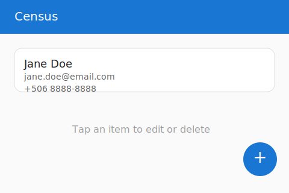
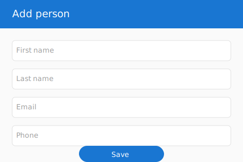

# Census Android App

## Descripción del proyecto
Aplicación Android desarrollada en Kotlin siguiendo la arquitectura MVVM. Permite gestionar un censo básico de personas con operaciones CRUD completas respaldadas por Room para la persistencia local. La interfaz incluye navegación mediante menú, confirmaciones con `AlertDialog` y soporte multilenguaje (español e inglés).

## Requisitos
- Android Studio Iguana o superior.
- Android Gradle Plugin 8.13.
- Kotlin 2.0.21.
- Dispositivo o emulador con Android 13 (API 33) o superior.

## Cómo ejecutar
1. Clonar este repositorio.
2. Abrir la carpeta `census` en Android Studio.
3. Sincronizar el proyecto para descargar dependencias.
4. Ejecutar la aplicación en un dispositivo/emulador (botón **Run**).

## Capturas de pantalla
| Lista de personas | Formulario de persona |
| --- | --- |
|  |  |

> Las capturas son representaciones esquemáticas del diseño final incluidas para referencia rápida.
